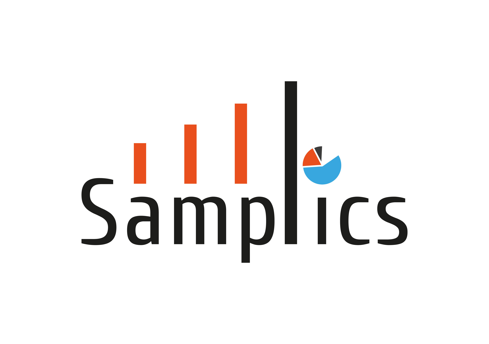

<h1>samplics</h1>

[](https://github.com/samplics-org/samplics/actions?query=workflow%3ATesting)
[](https://github.com/samplics-org/samplics/actions?query=workflow%3ACoverage)
[](https://doi.org/10.21105/joss.03376)
[](https://pepy.tech/project/samplics)

> **⚠️ samplics is no longer maintained. Use [svy](https://pypi.org/project/svy/) instead.**
>
> **svy** is the successor to _samplics_, from the same author: the same survey
> methodology (design, sampling, weighting, estimation, small area models),
> rebuilt on Polars with a Rust core, an end-to-end workflow through reporting,
> and active development.
>
> ```bash
> pip install svy
> ```
>
> - Docs and migration guide: https://svylab.com/docs/svy
> - Questions about migrating: https://github.com/samplics-org/svy/issues
>
> samplics 0.6.x stays on PyPI and keeps working, but no bugs will be fixed and
> no new Python versions will be supported.

<br>

_Samplics_ was a Python package for design-based analysis of complex survey data, covering sample size calculation, selection, weighting, estimation, and small area estimation. It has been superseded by [svy](https://svylab.com/docs).

## Citation

If you use _samplics_ in published research, please cite:

**Diallo, M.S.** (2021). samplics: a Python Package for Selecting, Weighting and Analyzing Data from Complex Sampling Designs. _Journal of Open Source Software_, 6(68), 3376. https://doi.org/10.21105/joss.03376

```bibtex
@article{Diallo2021,
  author  = {Diallo, Mamadou S.},
  title   = {samplics: a Python Package for Selecting, Weighting and Analyzing Data from Complex Sampling Designs},
  journal = {Journal of Open Source Software},
  year    = {2021},
  volume  = {6},
  number  = {68},
  pages   = {3376},
  doi     = {10.21105/joss.03376},
  url     = {https://doi.org/10.21105/joss.03376}
}
```

## License

[MIT](https://github.com/samplics-org/samplics/blob/master/license.txt)

## Contact

Created by [svyLab](https://svylab.com) · [info@svylab.com](mailto:info@svylab.com)
